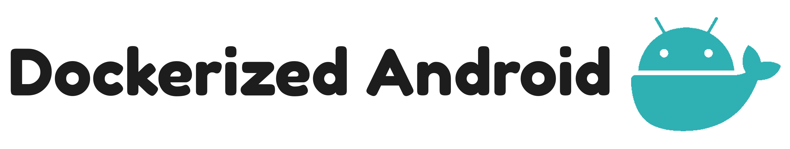
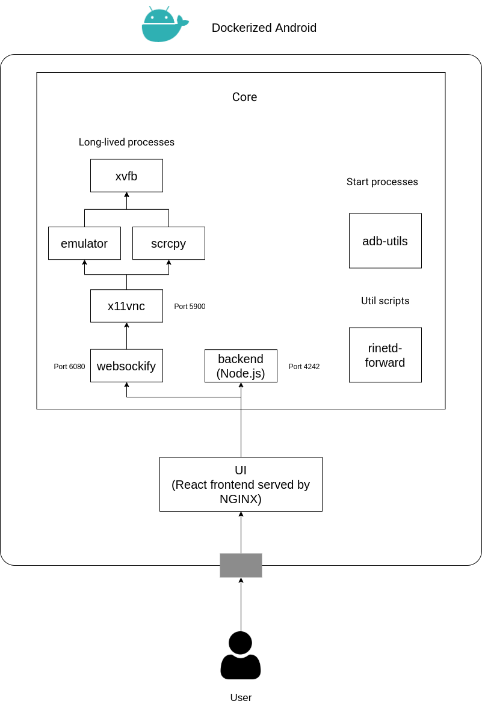
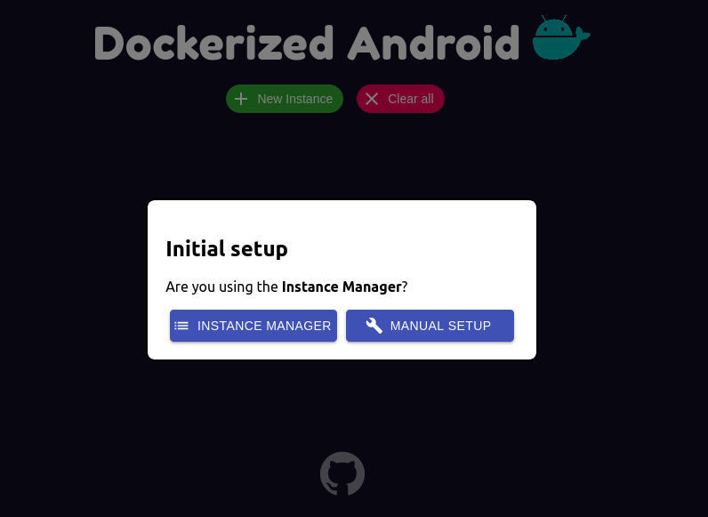

# Dockerized Android
<p align="center">
  
</p>

**Dockerized Android** is a container-based framework that allows to execute and Android Emulator inside Docker and control it through a browser. This project has been developed in order to provide a starting point for integrating mobile security components into Cyber Ranges but it can be used for any purpose. Anyway, for development and testing purposes the project suggested is [docker-android](https://github.com/budtmo/docker-android).

<p align="center">
  
</p>

[](https://hub.docker.com/u/secsi)
[](https://github.com/cybersecsi/dockerized-android)
[](https://github.com/cybersecsi/dockerized-android/blob/main/README.md)
[](https://github.com/cybersecsi/dockerized-android/blob/main/LICENSE.md)

## Table of contents
  - [Table of contents](#table-of-contents)
  - [Introduction](#introduction)
  - [Features](#features)
  - [Architecture](#architecture)
    - [Core Component](#core-component)
    - [UI Component](#ui-component)
    - [Instance Manager Component](#instance-manager-component)
  - [List of Docker images](#list-of-docker-images)
  - [How to run](#how-to-run)
    - [Prerequisites](#prerequisites)
    - [OS compatibility](#os-compatibility)
    - [OS X Workaround for Real Device](#os-x-workaround-for-real-device)
    - [Run](#run)
    - [Build](#build)
  - [Configuration](#configuration)
  - [License](#license)
  - [Who talks about Dockerized Android](#who-talks-about-dockerized-android)
  - [Credits](#credits)


## Introduction
As stated in the brief description above this project has been created in order to provide a starting point for the introduction of mobile security components into Cyber Ranges. For this reasons the features already developed and the ones that will be added in the feature will help the user to make easier to setup a realistic simulation (for example for security training). This README is quite long, maybe you just wanna skip to the *"How to run"* part.
## Features
The following features are currently available:
- Run an Android Emulator in Docker
- Control the device through the web browser
- Install applications
- Enable port forwarding
- Reboot the device
- Emulate SMS
- Use the terminal from the web browser
- Attach also a physical device
- Customize startup behaviour (see Configuration section)
- Easily manage multiple instances

[initial-setup]: <docs/initial-setup.png>
[instance-manager-setup]: <docs/instance-manager-setup.png>
[manual-setup]: <docs/manual-setup.png>
[toolbox]: <docs/toolbox.png>
[instance-switch]: <docs/instance-switch.png>

| Initial setup   |  Instance Manager Setup  |  Manual Setup  |
|-----------------|:------------------------:|:--------------:|
| [initial-setup] | [instance-manager-setup] | [manual-setup] |


| Toolbox features |  Instance Switch  |
|------------------|:-----------------:|
| [toolbox]        | [instance-switch] |

## Architecture
The project is composed by three main pieces:
- Dockerized Android **Core**
- Dockerized Android **UI**
- Dockerized Android **Instance Manager** (optional)
The following figure provides an overview of the actual architecture of the two mandatory components

<p align="center">
  
</p>

### Core Component
The Core component is the one that executes all the processes needed to run an Android Com-ponent (Emulated or Real) inside a Docker container, also ex-posing some features to the outside.
It is with no doubt the most complex part becauseit has to manage different processes in order to provide a set of features. The above figure shows a clear distinction between long-lived processes,start processes and util scripts. Besides, this figure shows that there are 6 long-lived processes, this is a little inaccuracy added to provide a general overview of the Core component, in reality there are two different flavours of the Core component:
- Core for Emulator
- Core for Real Device
  
The main architectural difference is the one regarding the long-lived processess: the Core for Emulator runs the long-lived **emulator** process while the Core for Real Device runs the long-lived **scrcpy** process to display and control the physical device. The other parts are quite similar with just some logic to follow a different behaviour based on the type of the Core component.

### UI Component
The UI component provides a simple way to use all the features exposed by the backend and also adds the ability to display and control the device. The user has to manually insert the address of the Core component and the corresponding ports (the port exposed by the backend and the port exposed by websockify); through this manual setup it is possible to change the default ports (which are 4242 for the backend and 6080 for websockify).

### Instance Manager Component
The Instance Manager component has the job to provide all the informations(i.e., addresses and ports) about the running Cores through a single REST API. This is done by writing a simple JSON configuration file that contains all the information about the Cores that are present into the *docker-compose* in order to avoid the painful job of manually adding one by one. The structure of the JSON configuration file is the following:
```
{
    "instances": [
        {
            "name": [Generic string to identify the device],
            "address": [Address of the component],
            "core_port": [Port of the backend],
            "vnc_port": [Port of VNC]
        }
    ]
}
```

## List of Docker images
| Android Version | API | Image                                              |
|-----------------|:---:|----------------------------------------------------|
| 5.0.1           |  21 | secsi/dockerized-android-core-emulator-5.0.1 |
| 5.1.1           | 22  | secsi/dockerized-android-core-emulator-5.1.1 |
| 6.0             | 23  | secsi/dockerized-android-core-emulator-6.0   |
| 7.0             | 24  | secsi/dockerized-android-core-emulator-7.0   |
| 7.1.1           | 25  | secsi/dockerized-android-core-emulator-7.1.1 |
| 8.0             | 26  | secsi/dockerized-android-core-emulator-8.0   |
| 8.1             | 27  | secsi/dockerized-android-core-emulator-8.1   |
| 9.0             | 28  | secsi/dockerized-android-core-emulator-9.0   |
| 10.0            | 29  | secsi/dockerized-android-core-emulator-10.0  |
| 11.0            | 30  | secsi/dockerized-android-core-emulator-11.0  |
| -               | -   | secsi/dockerized-android-core-bare           |
| -               | -   | secsi/docker-android-core-real-device        |

The *secsi/dockerized-android-core-bare* does not download any system image and you may mount the folder on your host machine where you have all the SDK folders

## How to run
In order to see a full example on how to run the platform you may watch the *docker-compose* available in the **examples** directory. This directory contains three different configurations:
* **docker-compose-core**: setup with a core for a real device;
* **docker-compose-emulator**: setup with a core for an emulator;
* **docker-compose-instance-manager**: setup with two different core and also the **optional** Instance Manager component. 
  
Once you understood how it works you may change it to satisfy any needs you have.

### Prerequisites
Docker and Docker Compose have to be installed on your machine.

### OS compatibility
This platform behaves in different ways based on the host OS, here is a table that summarizes the current compatibility:
|                      |        Linux       | Windows             | OS X          |
|----------------------|:------------------:|---------------------|---------------|
| Core for Emulator    | Full compatibility | Not supported (yet) | Not supported |
| Core for Real Device | Full compatibility | Full compatibility  | Workaround    |

For Windows and OS X you have to use a Linux VM with nested virtualization.

To check if your Linux machine supports nested virtualization you may run the following commands:
```
sudo apt install cpu-checker
kvm-ok
```

### OS X Workaround for Real Device
To use the Core for Real Device on OS X you may:
- Use the adb of the host
- Use wireless connection

For the wireless connection Google provides a simple [tutorial](https://developer.android.com/things/hardware/wifi-adb). To connect to the host adb from within the container you have to manually enter inside the container and run:
```
adb -H host.docker.internal devices
```

### Run
The commands to start using the framework are as follows:
1. Firstly, choose a configuration found in the examples folder. For example:
```bash
cp ./examples/docker-compose-core.yml docker-compose.yml
```
2. Run with docker-compose:
```bash
docker-compose up
```
> More simply you can also use the command: 
> 
> ``docker-compose -f ./examples/docker-compose-core.yml up``

All that remains is to navigate through a browser at the following address **http://127.0.0.1:8080** and set the current configuration:
<p align="center">
  
</p>

If the *Instance Manager* was **not** used, click on **Manual Setup** and enter the following information:
1. A name of your choosing for the instance;
2. IP address of component core declared in docker-compose;
3. Core port number (**4242** by default);
4. VNC port number (**6080** by default).

> If the **Instance Manager** is used, click on "*Instance Manager*" and just enter the **IP address** and its **port number** (for example, **193.21.1.100:7373**).

That's it! You can use the framework within the browser.
### Build
You may also build the images yourself throught the scripts placed in the *utils* folder

## Configuration
You may configure some features to customize the setup through ENV variables, the following table provides a list of all of them:

| Component        |         ENV Name        | Default value                | Description                                                                                                                                                                  |
|------------------|:-----------------------:|------------------------------|------------------------------------------------------------------------------------------------------------------------------------------------------------------------------|
| Core             |       TARGET_PORT       | 6080                         | Websockify port                                                                                                                                                              |
| Core             | CUSTOM_APP_DEFAULT_PORT | 4242                         | Node.js backend port                                                                                                                                                         |
| Core             | DEVICEINFO              | Unset, but behaves like true | Enables/Disables the device info feature                                                                                                                                     |
| Core             | TERMINAL                | Unset, but behaves like true | Enables/Disables the terminal feature                                                                                                                                        |
| Core             | APK                     | Unset, but behaves like true | Enables/Disables the install APK feature                                                                                                                                     |
| Core             | FORWARD                 | Unset, but behaves like true | Enables/Disables the port forward feature                                                                                                                                    |
| Core             | SMS                     | Unset, but behaves like true | Enables/Disables the SMS emulation feature                                                                                                                                   |
| Core             | REBOOT                  | Unset, but behaves like true | Enables/Disables the reboot feature                                                                                                                                          |
| Core             | INSTALL_ON_STARTUP      | false                        | Enables/Disables the feature that allows to install all the apks placed in the/root/dockerized-android/apk folde                                                             |
| Core             | ENABLE_UNKNOWN_SOURCES  | false                        | Enables the install from unknown sources                                                                                                                                     |
| Core             | REAL_DEVICE_SERIAL      | unset                        | If there is more than one physical device connected this value must be set to the serial of the device that has to be controlled otherwise all the other features won't work |
| Instance Manager | DEFAULT_PORT            | 7373                         | Port of the REST API                                                                                                                                                         |

The **REAL_DEVICE_SERIAL** variable is **fundamental** if there is more than one physical device attached because if missing nothing will work.
Finally there is a list of exposed ports by each component:

| Component        | Port # | Description            |
|------------------|:------:|------------------------|
| Core             |  5555  | ADB port               |
| Core             |  4242  | Node.js Backend        |
| Core             |  6080  | Websockify (for noVNC) |
| UI               | 80     | Frontend               |
| Instance Manager | 7373   | REST API               |

## License
**Dockerized Android** is an open-source and free software released under the [MIT License](/LICENSE.md).
## Who talks about Dockerized Android
* SecSI 
  - https://secsi.io/blog/a-container-based-framework-for-android-emulation-and-hacking/
* KitPloit 
  - https://www.kitploit.com/2021/10/dockerized-android-container-based.html
  - https://www.kitploit.com/2021/12/top-20-most-popular-hacking-tools-in.html
## Credits
This project represents our Master's thesis paper in Computer Engineering at the *University Federico II of Naples*.
Special thanks to Professor [**Simon Pietro Romano**](https://www.docenti.unina.it/#!/professor/53494d4f4e2050494554524f524f4d414e4f524d4e534e503732413033463833394d/riferimenti) and Engineer [**Francesco Caturano**](https://github.com/catuhub), sources of inspiration for this work.